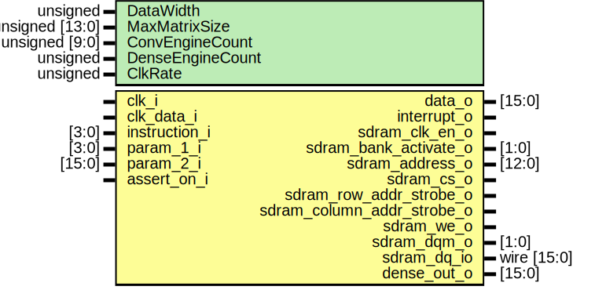

# Entity: aether_engine 
- **File**: aether_engine.sv

## Diagram

## Generics

| Generic name     | Type            | Value       | Description                                                |
| ---------------- | --------------- | ----------- | ---------------------------------------------------------- |
| DataWidth        | unsigned        | undefined   |                                                            |
| MaxMatrixSize    | unsigned [13:0] | undefined   | 16383 maximum matrix size that this convolver can convolve |
| ConvEngineCount  | unsigned [9:0]  | undefined   | 1023 Amount of instantiated convolvers                     |
| DenseEngineCount | unsigned        | undefined   | Amount of instantiated dense layers                        |
| ClkRate          | unsigned        | 143_000_000 |                                                            |

## Ports

| Port name                  | Direction | Type        | Description                                        |
| -------------------------- | --------- | ----------- | -------------------------------------------------- |
| clk_i                      | input     |             |                                                    |
| clk_data_i                 | input     |             | clock for input data
   *(This is a stretch goal)* |
| instruction_i              | input     | [3:0]       |                                                    |
| param_1_i                  | input     | [3:0]       |                                                    |
| param_2_i                  | input     | [15:0]      |                                                    |
| data_o                     | output    | [15:0]      |                                                    |
| interrupt_o                | output    |             |                                                    |
| sdram_clk_en_o             | output    |             |                                                    |
| sdram_bank_activate_o      | output    | [1:0]       |                                                    |
| sdram_address_o            | output    | [12:0]      |                                                    |
| sdram_cs_o                 | output    |             |                                                    |
| sdram_row_addr_strobe_o    | output    |             |                                                    |
| sdram_column_addr_strobe_o | output    |             |                                                    |
| sdram_we_o                 | output    |             |                                                    |
| sdram_dqm_o                | output    | [1:0]       |                                                    |
| sdram_dq_io                | inout     | wire [15:0] |                                                    |
| assert_on_i                | input     |             |                                                    |
| dense_out_o                | output    | [15:0]      |                                                    |

## Signals

| Name                                                                | Type                                     | Description                                                                                  |
| ------------------------------------------------------------------- | ---------------------------------------- | -------------------------------------------------------------------------------------------- |
| current_cmd                                                         | logic [23:0]                             |                                                                                              |
| rst_conv_weight                                                     | logic                                    |                                                                                              |
| rst_conv                                                            | logic                                    |                                                                                              |
| rst_dense_weight                                                    | logic                                    |                                                                                              |
| rst_dense                                                           | logic                                    |                                                                                              |
| rst_regs                                                            | logic                                    |                                                                                              |
| rst_full                                                            | logic                                    |                                                                                              |
| load_conv_weights                                                   | logic                                    |                                                                                              |
| load_dense_weights                                                  | logic                                    |                                                                                              |
| ldw_strt                                                            | logic                                    |                                                                                              |
| ldw_cont                                                            | logic                                    |                                                                                              |
| lip_strt                                                            | logic                                    |                                                                                              |
| lip_cont                                                            | logic                                    |                                                                                              |
| ldw_move                                                            | logic                                    |                                                                                              |
| load_mem_from_buffer                                                | logic                                    |                                                                                              |
| run_conv                                                            | logic                                    |                                                                                              |
| cnv_save_addr                                                       | logic [19:0]                             |                                                                                              |
| conv_data[ConvEngineCount-1:0]                                      | logic signed [DataWidth-1:0]             |                                                                                              |
| conv_data_mem                                                       | logic [15:0]                             |                                                                                              |
| conv_valid                                                          | logic                                    |                                                                                              |
| conv_done                                                           | logic                                    |                                                                                              |
| conv_save_mem                                                       | logic                                    |                                                                                              |
| conv_save_done                                                      | logic                                    |                                                                                              |
| conv_save_mem_running                                               | logic                                    |                                                                                              |
| run_dense                                                           | logic                                    |                                                                                              |
| dns_save_addr                                                       | logic [19:0]                             |                                                                                              |
| dense_out[DenseEngineCount-1:0]                                     | logic signed [DataWidth-1:0]             |                                                                                              |
| mem_command                                                         | logic [1:0]                              |                                                                                              |
| mem_data_read                                                       | logic [15:0]                             |                                                                                              |
| mem_data_read_valid                                                 | logic                                    |                                                                                              |
| data_write_ready                                                    | logic                                    |                                                                                              |
| mem_task_finished                                                   | logic                                    |                                                                                              |
| mem_task_running                                                    | logic                                    |                                                                                              |
| dense_out_temp                                                      | logic signed [15:0]                      |                                                                                              |
| input_buffer_addr                                                   | logic [BuffAddrSize-1:0]                 |                                                                                              |
| load_from_input_buffer                                              | logic                                    |                                                                                              |
| input_buffer_count                                                  | logic [BuffAddrSize-1:0]                 |                                                                                              |
| input_buffer_data                                                   | logic [15:0]                             |                                                                                              |
| mem_count_difference                                                | logic [BuffAddrSize-1:0]                 |                                                                                              |
| conv_kernel_weights[ConvEngineCount-1:0][KernelSize*KernelSize-1:0] | logic signed [DataWidth-1:0]             |                                                                                              |
| load_conv_weights_longterm                                          | logic                                    |                                                                                              |
| weight_shift_store[ConvWeightSizeMem-1:0]                           | logic [15:0]                             |                                                                                              |
| raw_store                                                           | logic [(ConvWeightSizeMem * 16)-1:0]     |                                                                                              |
| conv_no_data                                                        | logic                                    |                                                                                              |
| conv_activation_data                                                | logic signed [DataWidth-1:0]             |                                                                                              |
| data_a                                                              | logic signed [7:0]                       |                                                                                              |
| data_b                                                              | logic signed [7:0]                       |                                                                                              |
| data_number                                                         | logic                                    |                                                                                              |
| conv_running                                                        | logic                                    |                                                                                              |
| data_number_buf                                                     | logic                                    |                                                                                              |
| conv_save_mem_store[ConvEngineCountCeil-1:0]                        | logic [15:0]                             |                                                                                              |
| conv_store_raw                                                      | logic [16*ConvEngineCountCeil-1:0]       |                                                                                              |
| engine_count_16b                                                    | logic [clog2(ConvEngineCountCeil+1)-1:0] |                                                                                              |
| data_array[DenseEngineCount-1:0]                                    | logic signed [DataWidth-1:0]             | -------------------------------------------------------------------------------------------- |
| weight_array[DenseEngineCount-1:0]                                  | logic signed [DataWidth-1:0]             |                                                                                              |
| data_write                                                          | logic [15:0]                             |                                                                                              |
| mem_start_address                                                   | logic [31:0]                             |                                                                                              |
| mem_end_address                                                     | logic [31:0]                             |                                                                                              |
| mem_en                                                              | logic                                    |                                                                                              |

## Constants

| Name                | Type | Value                                                                         | Description |
| ------------------- | ---- | ----------------------------------------------------------------------------- | ----------- |
| Ratio               |      | DataWidth / 16                                                                |             |
| InputBuffer         |      | ((MaxMatrixSize ** 2) * DataWidth / 16)                                       |             |
| BuffAddrSize        |      | (InputBuffer + 1)                                                             |             |
| LastBufferAddr      |      | InputBuffer - 1                                                               |             |
| KernelSize          |      | 3                                                                             |             |
| ConvWeightSizeMem   |      | (KernelSize**2 * ConvEngineCount) / 2 + (KernelSize**2 * ConvEngineCount) % 2 |             |
| ConvEngineCountCeil |      | (ConvEngineCount / 2) + (ConvEngineCount % 2)                                 |             |

## Processes
- unnamed: (  )
  - **Type:** always_comb
- unnamed: (  )
  - **Type:** always_comb
- unnamed: (  )
  - **Type:** always_comb

## Instantiations

- reg_versn: IVersn
- reg_hwrid: IHwrid
- reg_memup: IMemup
- reg_mstrt: IMstrt
- reg_mendd: IMendd
- reg_bcfg1: IBcfg1
- reg_bcfg2: IBcfg2
- reg_bcfg3: IBcfg3
- reg_cprm1: ICprm1
- reg_stats: IStats
- buffer_input_counter: simple_counter_end
- data_buffer_counter_inst: increment_then_stop
- input_buffer_bram: core_bram_dual_port
- load_buf_to_mem_wgts_inst: core_sr_ff
- load_wgts_to_mem_inst: core_sr_ff
- conv_weight_mem_shift_inst: core_shift_reg_store
- simple_counter_inst_a: simple_counter
- conv_need_data_singlefire: core_delay
- conv_layer_inst: convolution_layer
- conv_save_mem_delay_inst: core_sr_ff
- save_conv_to_mem: parallel_to_serial
- dense_inst: dense_layer
- decode_inst: aether_engine_decoder
- sys_ram_inst: aether_engine_generic_mem_simp
