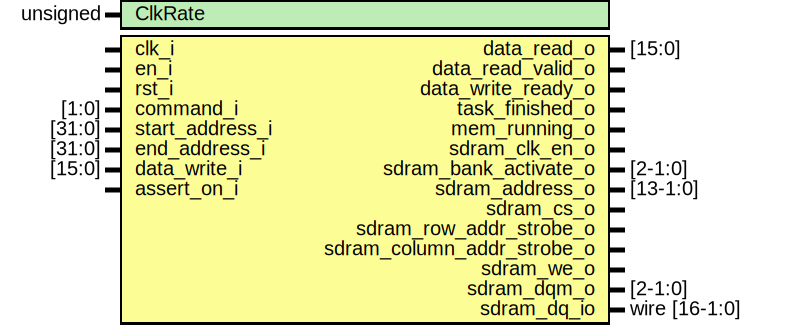

# Entity: aether_generic_mem 
- **File**: aether_generic_mem.sv

## Diagram

## Generics

| Generic name | Type     | Value       | Description |
| ------------ | -------- | ----------- | ----------- |
| ClkRate      | unsigned | 143_000_000 |             |

## Ports

| Port name                  | Direction | Type          | Description |
| -------------------------- | --------- | ------------- | ----------- |
| clk_i                      | input     |               |             |
| en_i                       | input     |               |             |
| rst_i                      | input     |               |             |
| command_i                  | input     | [1:0]         |             |
| start_address_i            | input     | [31:0]        |             |
| end_address_i              | input     | [31:0]        |             |
| data_write_i               | input     | [15:0]        |             |
| data_read_o                | output    | [15:0]        |             |
| data_read_valid_o          | output    |               |             |
| data_write_ready_o         | output    |               |             |
| task_finished_o            | output    |               |             |
| mem_running_o              | output    |               |             |
| sdram_clk_en_o             | output    |               |             |
| sdram_bank_activate_o      | output    | [2-1:0]       |             |
| sdram_address_o            | output    | [13-1:0]      |             |
| sdram_cs_o                 | output    |               |             |
| sdram_row_addr_strobe_o    | output    |               |             |
| sdram_column_addr_strobe_o | output    |               |             |
| sdram_we_o                 | output    |               |             |
| sdram_dqm_o                | output    | [2-1:0]       |             |
| sdram_dq_io                | inout     | wire [16-1:0] |             |
| assert_on_i                | input     |               |             |

## Signals

| Name                 | Type         | Description |
| -------------------- | ------------ | ----------- |
| mem_command_mid      | logic [1:0]  |             |
| mem_command          | logic [1:0]  |             |
| end_address_buffer   | logic [31:0] |             |
| start_address_buffer | logic [31:0] |             |
| addr_count           | logic [31:0] |             |
| bram_output          | logic [15:0] |             |
| task_finished_mid    | logic        |             |

## Constants

| Name  | Type | Value | Description |
| ----- | ---- | ----- | ----------- |
| IDLE  |      | 2'b00 |             |
| WRITE |      | 2'b01 |             |
| READ  |      | 2'b10 |             |

## Processes
- unnamed: ( @(posedge clk_i) )
  - **Type:** always

## Instantiations

- end_address_buffer_inst: d_delay_mult
- start_address_buffer_inst: d_delay_mult
- command_buffer: d_ff_mult
- command_buffer_2: d_ff_mult
- addr_counter: increment_then_stop
- memory_store_inst: single_port_bram
- task_finished_middle_inst: d_ff
- task_finished_inst: d_ff
- data_valid_buffer: d_ff
