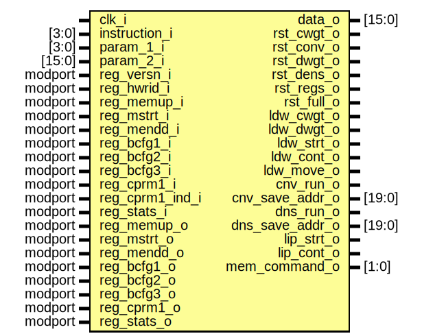

# Entity: aether_instruct_decoder 
- **File**: aether_instruct_decoder.sv

## Diagram

## Ports

| Port name       | Direction | Type             | Description |
| --------------- | --------- | ---------------- | ----------- |
| clk_i           | input     |                  |             |
| instruction_i   | input     | [3:0]            |             |
| param_1_i       | input     | [3:0]            |             |
| param_2_i       | input     | [15:0]           |             |
| data_o          | output    | [15:0]           |             |
| reg_versn_i     |           | IVersn.read_full |             |
| reg_hwrid_i     |           | IHwrid.read_full |             |
| reg_memup_i     |           | IMemup.read_full |             |
| reg_mstrt_i     |           | IMstrt.read_full |             |
| reg_mendd_i     |           | IMendd.read_full |             |
| reg_bcfg1_i     |           | IBcfg1.read_full |             |
| reg_bcfg2_i     |           | IBcfg2.read_full |             |
| reg_bcfg3_i     |           | IBcfg3.read_full |             |
| reg_cprm1_i     |           | ICprm1.read_full |             |
| reg_cprm1_ind_i |           | ICprm1.read      |             |
| reg_stats_i     |           | IStats.read_full |             |
| reg_memup_o     |           | IMemup.write_ext |             |
| reg_mstrt_o     |           | IMstrt.write_ext |             |
| reg_mendd_o     |           | IMendd.write_ext |             |
| reg_bcfg1_o     |           | IBcfg1.write_ext |             |
| reg_bcfg2_o     |           | IBcfg2.write_ext |             |
| reg_bcfg3_o     |           | IBcfg3.write_ext |             |
| reg_cprm1_o     |           | ICprm1.write_ext |             |
| reg_stats_o     |           | IStats.write_ext |             |
| rst_cwgt_o      | output    |                  |             |
| rst_conv_o      | output    |                  |             |
| rst_dwgt_o      | output    |                  |             |
| rst_dens_o      | output    |                  |             |
| rst_regs_o      | output    |                  |             |
| rst_full_o      | output    |                  |             |
| ldw_cwgt_o      | output    |                  |             |
| ldw_dwgt_o      | output    |                  |             |
| ldw_strt_o      | output    |                  |             |
| ldw_cont_o      | output    |                  |             |
| ldw_move_o      | output    |                  |             |
| cnv_run_o       | output    |                  |             |
| cnv_save_addr_o | output    | [19:0]           |             |
| dns_run_o       | output    |                  |             |
| dns_save_addr_o | output    | [19:0]           |             |
| lip_strt_o      | output    |                  |             |
| lip_cont_o      | output    |                  |             |
| mem_command_o   | output    | [1:0]            |             |

## Signals

| Name          | Type  | Description |
| ------------- | ----- | ----------- |
| ldw_mem_read  | logic |             |
| ldw_mem_write | logic |             |

## Constants

| Name      | Type | Value | Description |
| --------- | ---- | ----- | ----------- |
| MEM_IDLE  |      | 2'b00 |             |
| MEM_WRITE |      | 2'b01 |             |
| MEM_READ  |      | 2'b10 |             |

## Processes
- unnamed: (  )
  - **Type:** always_comb
- unnamed: (  )
  - **Type:** always_comb
- unnamed: (  )
  - **Type:** always_comb
- unnamed: (  )
  - **Type:** always_comb
- unnamed: (  )
  - **Type:** always_comb
- unnamed: (  )
  - **Type:** always_comb
- unnamed: (  )
  - **Type:** always_comb
- unnamed: (  )
  - **Type:** always_comb
