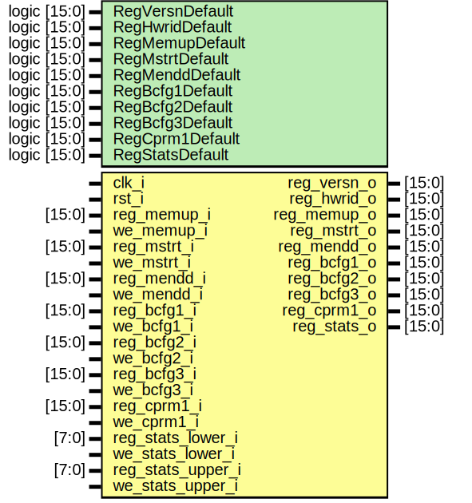

# Entity: aether_register_ff 
- **File**: aether_register_ff.sv

## Diagram

## Generics

| Generic name    | Type         | Value    | Description                                  |
| --------------- | ------------ | -------- | -------------------------------------------- |
| RegVersnDefault | logic [15:0] | 16'h6C00 | Version Register Value                       |
| RegHwridDefault | logic [15:0] | 16'hB2E9 | Hardware ID Register Value                   |
| RegMemupDefault | logic [15:0] | 16'h0000 | Upper Memory Address Register Reset Value    |
| RegMstrtDefault | logic [15:0] | 16'h0000 | Memory Start Address Register Reset Value    |
| RegMenddDefault | logic [15:0] | 16'h0000 | Memory End Address Register Reset Value      |
| RegBcfg1Default | logic [15:0] | 16'h0000 | Base Configuration Register 1 Reset Value    |
| RegBcfg2Default | logic [15:0] | 16'h0000 | Base Configuration Register 2 Reset Value    |
| RegBcfg3Default | logic [15:0] | 16'h0000 | Base Configuration Register 3 Reset Value    |
| RegCprm1Default | logic [15:0] | 16'h0040 | Convolution Parameter Register 1 Reset Value |
| RegStatsDefault | logic [15:0] | 16'h0000 | Stats Register Reset Value                   |

## Ports

| Port name         | Direction | Type   | Description                                           |
| ----------------- | --------- | ------ | ----------------------------------------------------- |
| clk_i             | input     |        |                                                       |
| rst_i             | input     |        |                                                       |
| reg_memup_i       | input     | [15:0] | Upper Memory Address Register                         |
| we_memup_i        | input     |        | Upper Memory Address Register Write Enable            |
| reg_mstrt_i       | input     | [15:0] | Memory Start Address Register                         |
| we_mstrt_i        | input     |        | Memory Start Address Register Write Enable            |
| reg_mendd_i       | input     | [15:0] | Memory End Address Register                           |
| we_mendd_i        | input     |        | Memory End Address Register Write Enable              |
| reg_bcfg1_i       | input     | [15:0] | Base Configuration Register 1                         |
| we_bcfg1_i        | input     |        | Base Configuration Register 1 Write Enable            |
| reg_bcfg2_i       | input     | [15:0] | Base Configuration Register 2                         |
| we_bcfg2_i        | input     |        | Base Configuration Register 2 Write Enable            |
| reg_bcfg3_i       | input     | [15:0] | Base Configuration Register 3                         |
| we_bcfg3_i        | input     |        | Base Configuration Register 3 Write Enable            |
| reg_cprm1_i       | input     | [15:0] | Convolution Parameter Register 1                      |
| we_cprm1_i        | input     |        | Convolution Parameter Register 1 Write Enable         |
| reg_stats_lower_i | input     | [7:0]  | Stats Register, Lower 8 Bits (User Sets)              |
| we_stats_lower_i  | input     |        | Stats Register, Lower 8 Bits Write Enable (User Sets) |
| reg_stats_upper_i | input     | [7:0]  | Stats Register, Upper 8 Bits (User Sets)              |
| we_stats_upper_i  | input     |        | Stats Register, Upper 8 Bits Write Enable (User Sets) |
| reg_versn_o       | output    | [15:0] | Version Register                                      |
| reg_hwrid_o       | output    | [15:0] | Hardware ID Register                                  |
| reg_memup_o       | output    | [15:0] | Upper Memory Address Register                         |
| reg_mstrt_o       | output    | [15:0] | Memory Start Address Register                         |
| reg_mendd_o       | output    | [15:0] | Memory End Address Register                           |
| reg_bcfg1_o       | output    | [15:0] | Base Configuration Register 1                         |
| reg_bcfg2_o       | output    | [15:0] | Base Configuration Register 2                         |
| reg_bcfg3_o       | output    | [15:0] | Base Configuration Register 3                         |
| reg_cprm1_o       | output    | [15:0] | Convolution Parameter Register 1                      |
| reg_stats_o       | output    | [15:0] | Stats Register                                        |

## Instantiations

- reg_memup_ff: core_d_ff
- reg_mstrt_ff: core_d_ff
- reg_mendd_ff: core_d_ff
- reg_bcfg1_ff: core_d_ff
- reg_bcfg2_ff: core_d_ff
- reg_bcfg3_ff: core_d_ff
- reg_cprm1_ff: core_d_ff
- reg_stats_lower_ff: core_d_ff
- reg_stats_upper_ff: core_d_ff
