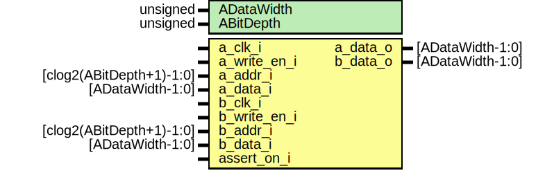

# Entity: core_bram_dual_port 
- **File**: core_bram_dual_port.sv

## Diagram

## Generics

| Generic name | Type     | Value     | Description |
| ------------ | -------- | --------- | ----------- |
| ADataWidth   | unsigned | undefined |             |
| ABitDepth    | unsigned | undefined |             |

## Ports

| Port name    | Direction | Type                     | Description |
| ------------ | --------- | ------------------------ | ----------- |
| a_clk_i      | input     |                          |             |
| a_write_en_i | input     |                          |             |
| a_addr_i     | input     | [clog2(ABitDepth+1)-1:0] |             |
| a_data_i     | input     | [ADataWidth-1:0]         |             |
| a_data_o     | output    | [ADataWidth-1:0]         |             |
| b_clk_i      | input     |                          |             |
| b_write_en_i | input     |                          |             |
| b_addr_i     | input     | [clog2(ABitDepth+1)-1:0] |             |
| b_data_i     | input     | [ADataWidth-1:0]         |             |
| b_data_o     | output    | [ADataWidth-1:0]         |             |
| assert_on_i  | input     |                          |             |

## Signals

| Name                  | Type                   | Description |
| --------------------- | ---------------------- | ----------- |
| memory[0:ABitDepth-1] | logic [ADataWidth-1:0] |             |

## Processes
- unnamed: ( @(posedge a_clk_i) )
  - **Type:** always
- unnamed: ( @(posedge a_clk_i) )
  - **Type:** always
- unnamed: ( @(posedge a_clk_i) )
  - **Type:** always
