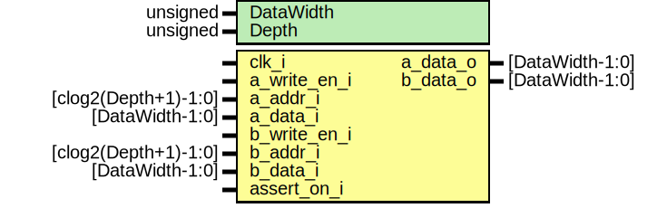

# Entity: dual_port_bram 
- **File**: dual_port_bram.sv

## Diagram

## Generics

| Generic name | Type     | Value     | Description |
| ------------ | -------- | --------- | ----------- |
| DataWidth    | unsigned | undefined |             |
| Depth        | unsigned | undefined |             |

## Ports

| Port name    | Direction | Type                 | Description |
| ------------ | --------- | -------------------- | ----------- |
| clk_i        | input     |                      |             |
| a_write_en_i | input     |                      |             |
| a_addr_i     | input     | [clog2(Depth+1)-1:0] |             |
| a_data_i     | input     | [DataWidth-1:0]      |             |
| a_data_o     | output    | [DataWidth-1:0]      |             |
| b_write_en_i | input     |                      |             |
| b_addr_i     | input     | [clog2(Depth+1)-1:0] |             |
| b_data_i     | input     | [DataWidth-1:0]      |             |
| b_data_o     | output    | [DataWidth-1:0]      |             |
| assert_on_i  | input     |                      |             |

## Signals

| Name              | Type                  | Description |
| ----------------- | --------------------- | ----------- |
| memory[0:Depth-1] | logic [DataWidth-1:0] |             |

## Processes
- unnamed: ( @(posedge clk_i) )
  - **Type:** always
- unnamed: ( @(posedge clk_i) )
  - **Type:** always
- unnamed: ( @(posedge clk_i) )
  - **Type:** always
