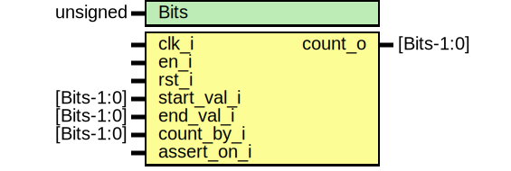

# Entity: counter 
- **File**: counter.sv

## Diagram

## Generics

| Generic name | Type     | Value     | Description |
| ------------ | -------- | --------- | ----------- |
| Bits         | unsigned | undefined |             |

## Ports

| Port name   | Direction | Type       | Description |
| ----------- | --------- | ---------- | ----------- |
| clk_i       | input     |            |             |
| en_i        | input     |            |             |
| rst_i       | input     |            |             |
| start_val_i | input     | [Bits-1:0] |             |
| end_val_i   | input     | [Bits-1:0] |             |
| count_by_i  | input     | [Bits-1:0] |             |
| count_o     | output    | [Bits-1:0] |             |
| assert_on_i | input     |            |             |

## Signals

| Name       | Type             | Description |
| ---------- | ---------------- | ----------- |
| next_count | logic [Bits-1:0] |             |

## Processes
- unnamed: ( @(posedge clk_i) )
  - **Type:** always
- unnamed: ( @(posedge clk_i or posedge rst_i) )
  - **Type:** always_ff
