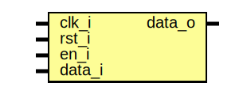

# Entity: d_ff 
- **File**: d_ff.sv

## Diagram

## Ports

| Port name | Direction | Type | Description |
| --------- | --------- | ---- | ----------- |
| clk_i     | input     |      |             |
| rst_i     | input     |      |             |
| en_i      | input     |      |             |
| data_i    | input     |      |             |
| data_o    | output    |      |             |

## Processes
- unnamed: ( @(posedge clk_i or posedge rst_i) )
  - **Type:** always_ff
