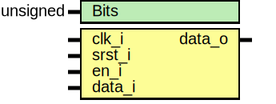

# Entity: core_d_ff_srst 
- **File**: core_d_ff_srst.sv

## Diagram

## Generics

| Generic name | Type     | Value | Description                                |
| ------------ | -------- | ----- | ------------------------------------------ |
| Bits         | unsigned | 1     | Bit width of the data, leave off for 1 bit |

## Ports

| Port name | Direction | Type | Description |
| --------- | --------- | ---- | ----------- |
| clk_i     | input     |      |             |
| srst_i    | input     |      |             |
| en_i      | input     |      |             |
| data_i    | input     |      |             |
| data_o    | output    |      |             |

## Processes
- unnamed: ( @(posedge clk_i) )
  - **Type:** always_ff
