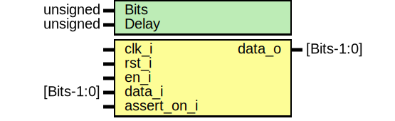

# Entity: core_delay 
- **File**: core_delay.sv

## Diagram

## Generics

| Generic name | Type     | Value     | Description        |
| ------------ | -------- | --------- | ------------------ |
| Bits         | unsigned | 1         |                    |
| Delay        | unsigned | undefined | Unit: Clock Cycles |

## Ports

| Port name   | Direction | Type       | Description                                       |
| ----------- | --------- | ---------- | ------------------------------------------------- |
| clk_i       | input     |            |                                                   |
| rst_i       | input     |            | Resets all values in the delay to 0               |
| en_i        | input     |            |                                                   |
| data_i      | input     | [Bits-1:0] |                                                   |
| data_o      | output    | [Bits-1:0] |                                                   |
| assert_on_i | input     |            | Used in simulations to disable asserts statements |

## Signals

| Name             | Type             | Description                          |
| ---------------- | ---------------- | ------------------------------------ |
| store[Delay-1:0] | logic [Bits-1:0] | Data storage for values in the delay |

## Processes
- assert_valid: ( @(posedge clk_i) )
  - **Type:** always
