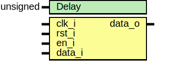

# Entity: d_delay 
- **File**: delay.sv

## Diagram

## Generics

| Generic name | Type     | Value     | Description |
| ------------ | -------- | --------- | ----------- |
| Delay        | unsigned | undefined |             |

## Ports

| Port name | Direction | Type | Description |
| --------- | --------- | ---- | ----------- |
| clk_i     | input     |      |             |
| rst_i     | input     |      |             |
| en_i      | input     |      |             |
| data_i    | input     |      |             |
| data_o    | output    |      |             |

## Signals

| Name             | Type  | Description |
| ---------------- | ----- | ----------- |
| store[Delay-1:0] | logic |             |

## Processes
- unnamed: ( @(posedge clk_i) )
  - **Type:** always
