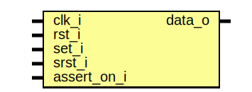

# Entity: sr_ff 
- **File**: sr_ff.sv

## Diagram

## Description

Typically Set and Reset are not active at the same time, and if it is then the defualt behavior would be undefined. This is not the "typical" implementation, but instead defines the behavior when both are active as setting the value. This is useful when having a running register, that is set at the start but cleared at the end. 
## Ports

| Port name   | Direction | Type | Description |
| ----------- | --------- | ---- | ----------- |
| clk_i       | input     |      |             |
| rst_i       | input     |      |             |
| set_i       | input     |      |             |
| srst_i      | input     |      |             |
| data_o      | output    |      |             |
| assert_on_i | input     |      |             |

## Processes
- unnamed: ( @(posedge clk_i) )
  - **Type:** always
- unnamed: ( @(posedge clk_i or posedge rst_i) )
  - **Type:** always_ff
