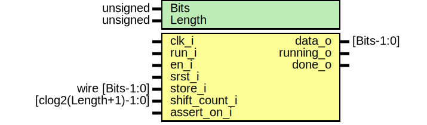

# Entity: core_parallel_to_serial 
- **File**: core_parallel_to_serial.sv

## Diagram

## Generics

| Generic name | Type     | Value     | Description         |
| ------------ | -------- | --------- | ------------------- |
| Bits         | unsigned | undefined | Width of the data   |
| Length       | unsigned | undefined | Number of registers |

## Ports

| Port name     | Direction | Type                  | Description                       |
| ------------- | --------- | --------------------- | --------------------------------- |
| clk_i         | input     |                       |                                   |
| run_i         | input     |                       |                                   |
| en_i          | input     |                       |                                   |
| srst_i        | input     |                       |                                   |
| store_i       | input     | wire [Bits-1:0]       | The reset register for every data |
| shift_count_i | input     | [clog2(Length+1)-1:0] | The number of shift               |
| data_o        | output    | [Bits-1:0]            |                                   |
| running_o     | output    |                       |                                   |
| done_o        | output    |                       |                                   |
| assert_on_i   | input     |                       |                                   |

## Signals

| Name              | Type                  | Description |
| ----------------- | --------------------- | ----------- |
| store[Length-1:0] | logic [Bits-1:0]      |             |
| running           | logic                 |             |
| position_count    | logic [CountSize-1:0] |             |
| shift_buffer      | logic                 |             |

## Constants

| Name      | Type | Value        | Description |
| --------- | ---- | ------------ | ----------- |
| CountSize |      | (Length + 1) |             |

## Instantiations

- running_delay_inst: core_sr_ff
- output_position_count: core_increment_then_stop_srts
- shift_buffer_inst: core_d_ff_srst
- done_inst: core_d_ff_srst
