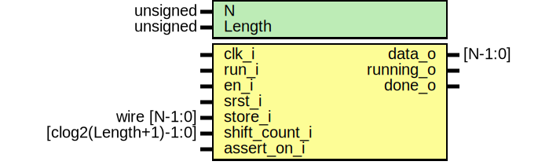

# Entity: parallel_to_serial 
- **File**: parallel_to_serial.sv

## Diagram

## Generics

| Generic name | Type     | Value     | Description |
| ------------ | -------- | --------- | ----------- |
| N            | unsigned | undefined |             |
| Length       | unsigned | undefined |             |

## Ports

| Port name     | Direction | Type                  | Description |
| ------------- | --------- | --------------------- | ----------- |
| clk_i         | input     |                       |             |
| run_i         | input     |                       |             |
| en_i          | input     |                       |             |
| srst_i        | input     |                       |             |
| store_i       | input     | wire [N-1:0]          |             |
| shift_count_i | input     | [clog2(Length+1)-1:0] |             |
| data_o        | output    | [N-1:0]               |             |
| running_o     | output    |                       |             |
| done_o        | output    |                       |             |
| assert_on_i   | input     |                       |             |

## Signals

| Name              | Type                  | Description |
| ----------------- | --------------------- | ----------- |
| store[Length-1:0] | logic [N-1:0]         |             |
| running           | logic                 |             |
| position_count    | logic [CountSize-1:0] |             |
| shift_buffer      | logic                 |             |

## Constants

| Name      | Type | Value        | Description |
| --------- | ---- | ------------ | ----------- |
| CountSize |      | (Length + 1) |             |

## Instantiations

- running_delay_inst: sr_ff
- output_position_count: increment_then_stop_srts
- shift_buffer_inst: d_ff_srst
- done_inst: d_ff_srst
