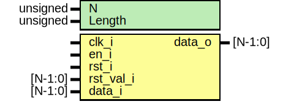

# Entity: shift_reg 
- **File**: shift_reg.sv

## Diagram

## Generics

| Generic name | Type     | Value     | Description |
| ------------ | -------- | --------- | ----------- |
| N            | unsigned | undefined |             |
| Length       | unsigned | undefined |             |

## Ports

| Port name | Direction | Type    | Description |
| --------- | --------- | ------- | ----------- |
| clk_i     | input     |         |             |
| en_i      | input     |         |             |
| rst_i     | input     |         |             |
| rst_val_i | input     | [N-1:0] |             |
| data_i    | input     | [N-1:0] |             |
| data_o    | output    | [N-1:0] |             |

## Signals

| Name              | Type        | Description |
| ----------------- | ----------- | ----------- |
| store[Length-1:0] | reg [N-1:0] |             |
