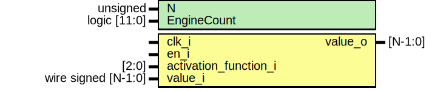

# Entity: activation_layer 
- **File**: activation_layer.sv

## Diagram

## Generics

| Generic name | Type         | Value     | Description |
| ------------ | ------------ | --------- | ----------- |
| N            | unsigned     | undefined |             |
| EngineCount  | logic [11:0] | 4095      |             |

## Ports

| Port name             | Direction | Type                 | Description |
| --------------------- | --------- | -------------------- | ----------- |
| clk_i                 | input     |                      |             |
| en_i                  | input     |                      |             |
| activation_function_i | input     | [2:0]                |             |
| value_i               | input     | wire signed  [N-1:0] |             |
| value_o               | output    | [N-1:0]              |             |

## Signals

| Name                               | Type                 | Description |
| ---------------------------------- | -------------------- | ----------- |
| next_outputs_relu[EngineCount-1:0] | logic signed [N-1:0] |             |

## Constants

| Name         | Type | Value | Description |
| ------------ | ---- | ----- | ----------- |
| ActivFN_None |      | 0     |             |
| ActivFN_Relu |      | 1     |             |

## Processes
- unnamed: ( @(posedge clk_i) )
  - **Type:** always_ff
