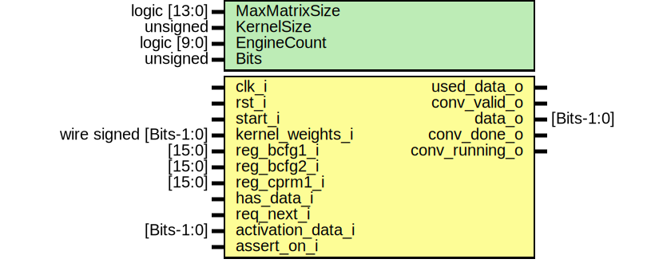

# Entity: convolution_layer 
- **File**: convolution_layer.sv

## Diagram

## Generics

| Generic name  | Type         | Value     | Description                                          |
| ------------- | ------------ | --------- | ---------------------------------------------------- |
| MaxMatrixSize | logic [13:0] | 16383     | maximum matrix size that this convolver can convolve |
| KernelSize    | unsigned     | undefined | kernel size                                          |
| EngineCount   | logic [9:0]  | 1023      | Amount of instantiated convolvers                    |
| Bits          | unsigned     | undefined | total bit width                                      |

## Ports

| Port name         | Direction | Type                   | Description                                                              |
| ----------------- | --------- | ---------------------- | ------------------------------------------------------------------------ |
| clk_i             | input     |                        |                                                                          |
| rst_i             | input     |                        |                                                                          |
| start_i           | input     |                        | Start the convolution process, only has to be active for one clock cycle |
| kernel_weights_i  | input     | wire signed [Bits-1:0] | Kernel Weights                                                           |
| reg_bcfg1_i       | input     | [15:0]                 |                                                                          |
| reg_bcfg2_i       | input     | [15:0]                 |                                                                          |
| reg_cprm1_i       | input     | [15:0]                 |                                                                          |
| has_data_i        | input     |                        |                                                                          |
| req_next_i        | input     |                        |                                                                          |
| activation_data_i | input     | [Bits-1:0]             |                                                                          |
| used_data_o       | output    |                        |                                                                          |
| conv_valid_o      | output    |                        |                                                                          |
| data_o            | output    | [Bits-1:0]             |                                                                          |
| conv_done_o       | output    |                        |                                                                          |
| conv_running_o    | output    |                        |                                                                          |
| assert_on_i       | input     |                        |                                                                          |

## Signals

| Name                                                              | Type            | Description |
| ----------------------------------------------------------------- | --------------- | ----------- |
| conv_done_c4                                                      | logic           |             |
| kernel_weights_buffer[EngineCount-1:0][KernelSize*KernelSize-1:0] | wire [Bits-1:0] |             |

## Instantiations

- conv_running_sr: core_sr_ff
