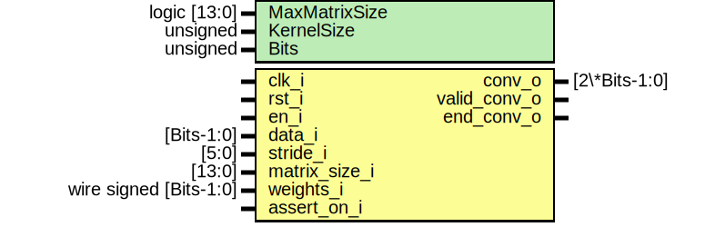

# Entity: convolver 
- **File**: convolver.sv

## Diagram

## Generics

| Generic name  | Type         | Value     | Description |
| ------------- | ------------ | --------- | ----------- |
| MaxMatrixSize | logic [13:0] | undefined |             |
| KernelSize    | unsigned     | undefined |             |
| N             | unsigned     | undefined |             |

## Ports

| Port name     | Direction | Type                | Description |
| ------------- | --------- | ------------------- | ----------- |
| clk_i         | input     |                     |             |
| rst_i         | input     |                     |             |
| en_i          | input     |                     |             |
| data_i        | input     | [N-1:0]             |             |
| stride_i      | input     | [5:0]               |             |
| matrix_size_i | input     | [13:0]              |             |
| weights_i     | input     | wire signed [N-1:0] |             |
| conv_o        | output    | [2*N-1:0]           |             |
| valid_conv_o  | output    |                     |             |
| end_conv_o    | output    |                     |             |
| assert_on_i   | input     |                     |             |

## Signals

| Name                                 | Type                         | Description |
| ------------------------------------ | ---------------------------- | ----------- |
| conv_vals[KernelSize*KernelSize-2:0] | logic [2*N-1:0]              |             |
| min_cycles                           | logic                        |             |
| row_conv                             | logic                        |             |
| stride_conv                          | logic                        |             |
| max_clk_count                        | logic [ClkCountSize-1:0]     |             |
| clk_count                            | logic [ClkCountSize-1:0]     |             |
| max_conv_count                       | logic [ConvCountSize-1:0]    |             |
| conv_count                           | logic [ConvCountSize-1:0]    |             |
| max_inv_count                        | logic [InvConcCountSize-1:0] |             |
| inv_count                            | logic [InvConcCountSize-1:0] |             |
| row_count                            | logic [RowCountSize-1:0]     |             |
| a                                    | logic                        |             |
| b                                    | logic                        |             |
| c                                    | logic                        |             |

## Constants

| Name             | Type | Value                               | Description |
| ---------------- | ---- | ----------------------------------- | ----------- |
| ClkCountSize     |      | (MaxMatrixSize * MaxMatrixSize + 2) |             |
| ConvCountSize    |      | (MaxMatrixSize - KernelSize + 1)    |             |
| InvConcCountSize |      | (KernelSize - 1)                    |             |
| RowCountSize     |      | (MaxMatrixSize - KernelSize + 1)    |             |

## Processes
- unnamed: ( @(posedge clk_i) )
  - **Type:** always
- unnamed: ( @(posedge clk_i or posedge rst_i) )
  - **Type:** always_ff

## Instantiations

- clk_counter: increment_then_stop
- conv_counter: counter
- inv_counter: counter
- row_counter: increment_then_stop
