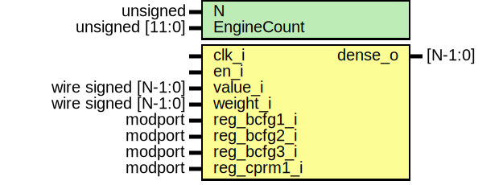

# Entity: dense_layer 
- **File**: dense_layer.sv

## Diagram

## Generics

| Generic name | Type            | Value     | Description |
| ------------ | --------------- | --------- | ----------- |
| N            | unsigned        | undefined |             |
| EngineCount  | unsigned [11:0] | 4095      |             |

## Ports

| Port name   | Direction | Type                | Description |
| ----------- | --------- | ------------------- | ----------- |
| clk_i       | input     |                     |             |
| en_i        | input     |                     |             |
| value_i     | input     | wire signed [N-1:0] |             |
| weight_i    | input     | wire signed [N-1:0] |             |
| dense_o     | output    | [N-1:0]             |             |
| reg_bcfg1_i |           | IBcfg1.read         |             |
| reg_bcfg2_i |           | IBcfg2.read         |             |
| reg_bcfg3_i |           | IBcfg3.read         |             |
| reg_cprm1_i |           | ICprm1.read         |             |

## Signals

| Name         | Type        | Description |
| ------------ | ----------- | ----------- |
| shift_amount | logic [5:0] |             |
