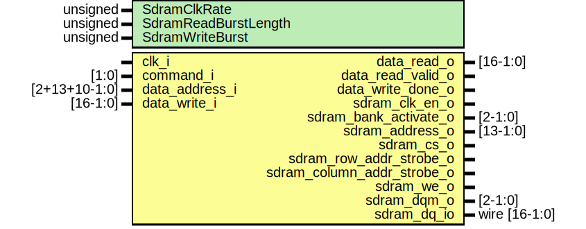

# Entity: de10_lite_sdram 
- **File**: de10_lite_sdram.sv

## Diagram

## Generics

| Generic name         | Type     | Value       | Description |
| -------------------- | -------- | ----------- | ----------- |
| SdramClkRate         | unsigned | 143_000_000 |             |
| SdramReadBurstLength | unsigned | 1           |             |
| SdramWriteBurst      | unsigned | 1           |             |

## Ports

| Port name                  | Direction | Type          | Description |
| -------------------------- | --------- | ------------- | ----------- |
| clk_i                      | input     |               |             |
| command_i                  | input     | [1:0]         |             |
| data_address_i             | input     | [2+13+10-1:0] |             |
| data_write_i               | input     | [16-1:0]      |             |
| data_read_o                | output    | [16-1:0]      |             |
| data_read_valid_o          | output    |               |             |
| data_write_done_o          | output    |               |             |
| sdram_clk_en_o             | output    |               |             |
| sdram_bank_activate_o      | output    | [2-1:0]       |             |
| sdram_address_o            | output    | [13-1:0]      |             |
| sdram_cs_o                 | output    |               |             |
| sdram_row_addr_strobe_o    | output    |               |             |
| sdram_column_addr_strobe_o | output    |               |             |
| sdram_we_o                 | output    |               |             |
| sdram_dqm_o                | output    | [2-1:0]       |             |
| sdram_dq_io                | inout     | wire [16-1:0] |             |

## Instantiations

- de_10_lite_sdram_inst: sdram_controller
