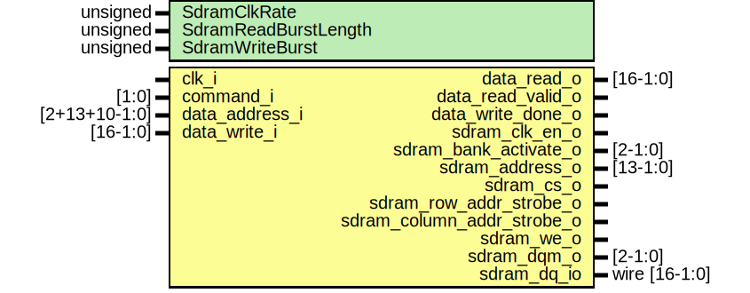

# Entity: de10_lite_sdram 
- **File**: sim_de10_lite_sdram.sv

## Diagram

## Generics

| Generic name         | Type     | Value     | Description                                                                |
| -------------------- | -------- | --------- | -------------------------------------------------------------------------- |
| SdramClkRate         | unsigned | undefined | Speed of your SDRAM clock in Hz                                            |
| SdramReadBurstLength | unsigned | undefined | 1, 2, 4, 8. All other values are reserved.                                 |
| SdramWriteBurst      | unsigned | undefined | OFF = Single write mode, ON = Burst write mode (same length as read burst) |

## Ports

| Port name                  | Direction | Type          | Description                                                                 |
| -------------------------- | --------- | ------------- | --------------------------------------------------------------------------- |
| clk_i                      | input     |               |                                                                             |
| command_i                  | input     | [1:0]         | 0 = Idle
  1 = Write (with Auto Precharge)
  2 = Read (with Auto Precharge) |
| data_address_i             | input     | [2+13+10-1:0] | BANK_ADDRESS_WIDTH + ROW_ADDRESS_WIDTH + COLUMN_ADDRESS_WIDTH               |
| data_write_i               | input     | [16-1:0]      |                                                                             |
| data_read_o                | output    | [16-1:0]      |                                                                             |
| data_read_valid_o          | output    |               | goes high when a burst-read is ready                                        |
| data_write_done_o          | output    |               | goes high once the first write of a burst-write / single-write is done      |
| sdram_clk_en_o             | output    |               |                                                                             |
| sdram_bank_activate_o      | output    | [2-1:0]       |                                                                             |
| sdram_address_o            | output    | [13-1:0]      |                                                                             |
| sdram_cs_o                 | output    |               |                                                                             |
| sdram_row_addr_strobe_o    | output    |               |                                                                             |
| sdram_column_addr_strobe_o | output    |               |                                                                             |
| sdram_we_o                 | output    |               |                                                                             |
| sdram_dqm_o                | output    | [2-1:0]       |                                                                             |
| sdram_dq_io                | inout     | wire [16-1:0] |                                                                             |

## Signals

| Name                    | Type         | Description |
| ----------------------- | ------------ | ----------- |
| bram_output             | logic [15:0] |             |
| bram_input              | logic [15:0] |             |
| burst_read_counter = 0  | logic [5:0]  |             |
| burst_write_counter = 0 | logic [5:0]  |             |
| read_started            | logic        |             |
| write_started           | logic        |             |
| command_buffer          | logic [1:0]  |             |

## Constants

| Name        | Type | Value | Description |
| ----------- | ---- | ----- | ----------- |
| IDLE        |      | 2'b00 |             |
| WRITE       |      | 2'b01 |             |
| READ        |      | 2'b10 |             |
| CAS_LATENCY |      | 3     |             |

## Processes
- unnamed: ( @(posedge clk_i) )
  - **Type:** always_ff

## Instantiations

- command_shift_inst: shift_reg
- burst_read_counter_inst: increment_then_stop
- burst_write_counter_inst: increment_then_stop
- memory_store_inst: single_port_bram
- read_shift_reg_inst: shift_reg
