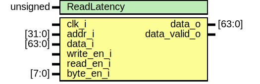

# Entity: sim_ddr_64_bit 
- **File**: sim_ddr_64_bit.sv

## Diagram

## Generics

| Generic name | Type     | Value | Description |
| ------------ | -------- | ----- | ----------- |
| ReadLatency  | unsigned | 16    |             |

## Ports

| Port name    | Direction | Type   | Description |
| ------------ | --------- | ------ | ----------- |
| clk_i        | input     |        |             |
| addr_i       | input     | [31:0] |             |
| data_i       | input     | [63:0] |             |
| write_en_i   | input     |        |             |
| read_en_i    | input     |        |             |
| byte_en_i    | input     | [7:0]  |             |
| data_o       | output    | [63:0] |             |
| data_valid_o | output    |        |             |

## Signals

| Name              | Type         | Description |
| ----------------- | ------------ | ----------- |
| bram_data_reg     | logic [64:0] |             |
| bram_data_shifted | logic [64:0] |             |
| bram_addr         | logic [28:0] |             |

## Constants

| Name    | Type | Value       | Description |
| ------- | ---- | ----------- | ----------- |
| RamSize |      | 32'h00000FF |             |

## Processes
- unnamed: ( @(posedge clk_i) )
  - **Type:** always

## Instantiations

- read_shift_reg_inst: shift_reg
